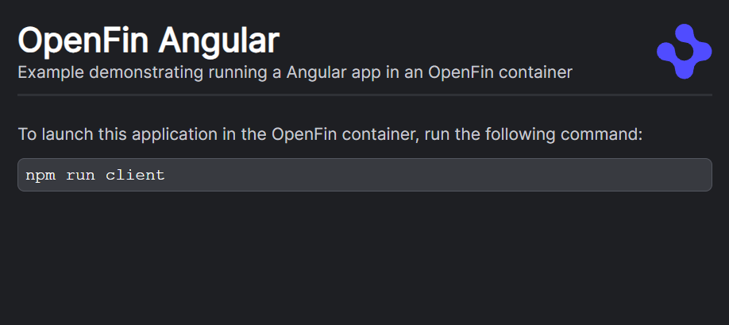
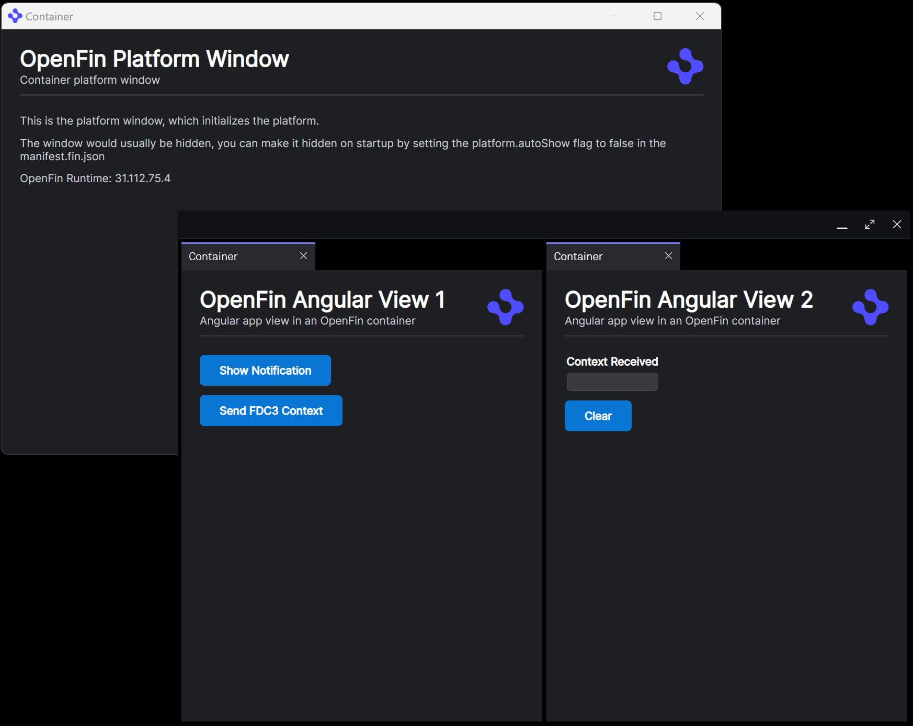
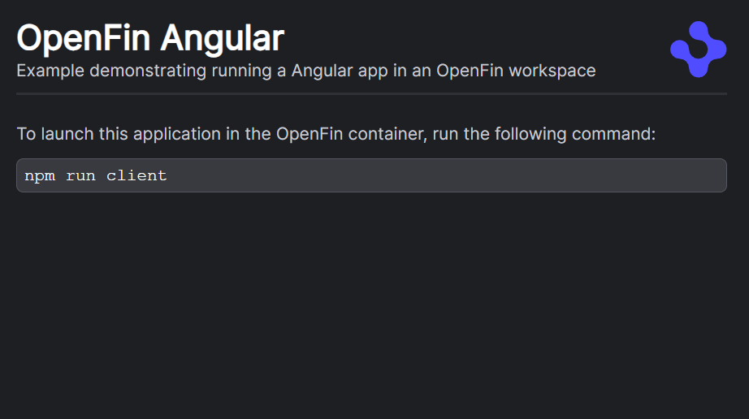
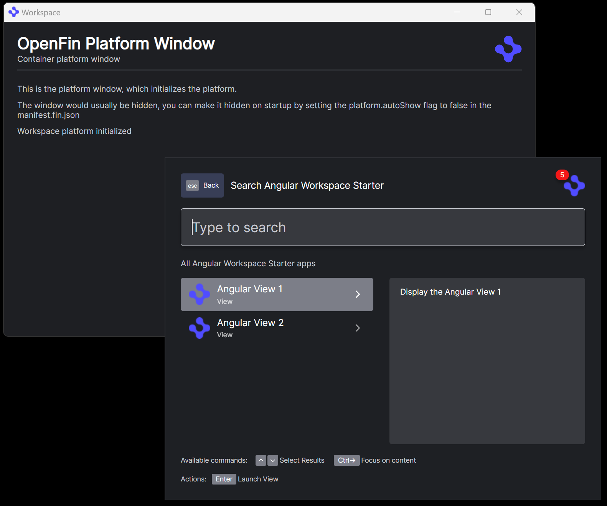
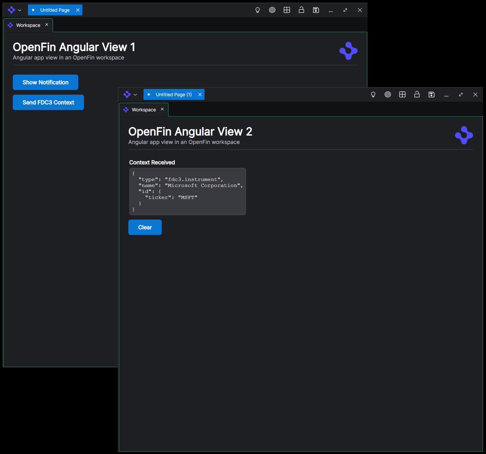
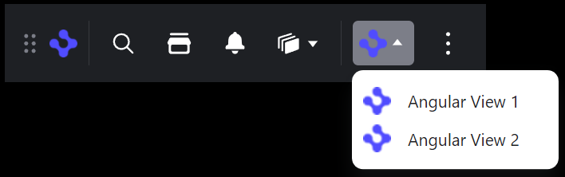
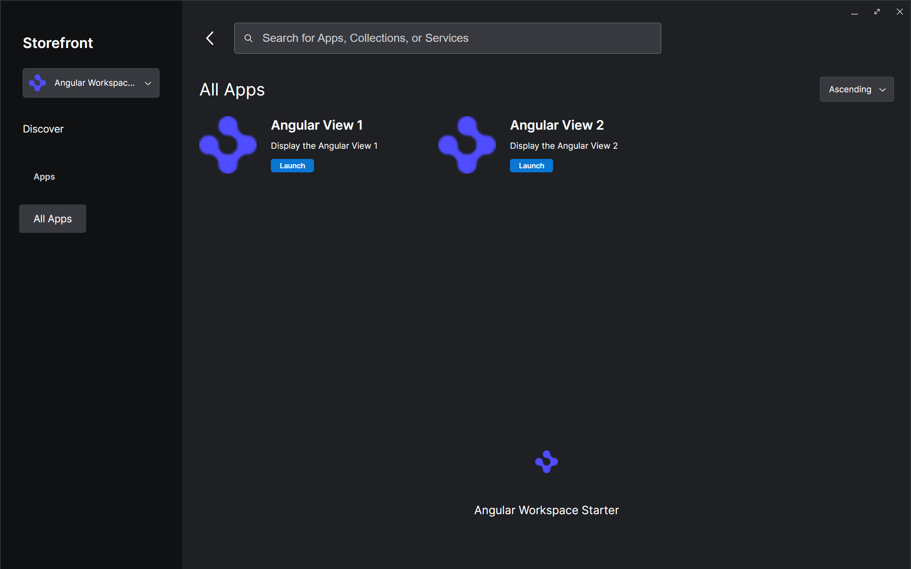
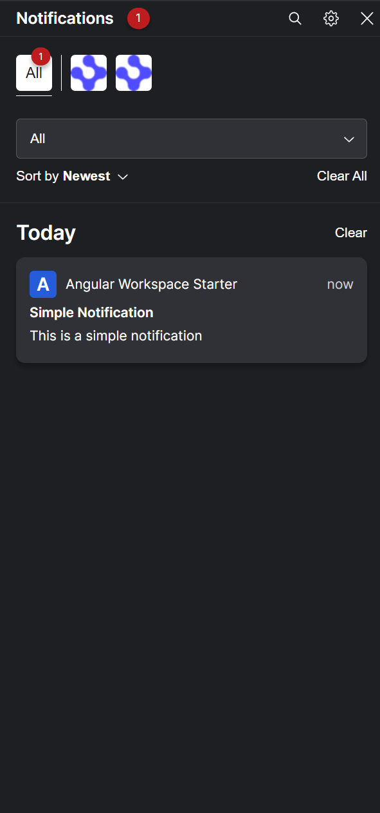

# Angular

Contained in this folder are samples for the following patterns.

* [container](./container) - A platform built using the OpenFin container technology.
* [workspace](./workspace) - A platform which demonstrates implementing an OpenFin workspace platform and interacting with its components.

## Container

For a guide on how this example was created see [creating-container.md](./creating-container.md)

When you execute this example with `npm run start`, you can launch [http://localhost:4200](http://localhost:4200) in your system browser (this is the [./container/src/app/app.component.ts](./container/src/app/app.component.ts) content).

If you then run `npm run client` it will start the platform instead, you should see the following.

The platform window content is the [./container/src/app/platform/platform.component.ts](./container/src/app/platform/platform.component.ts) which also initializes the platform.

The window with the two views are the [./container/src/app/view1/view1.component.ts](./container/src/app/view1/view1.component.ts) and [./container/src/app/view2/view2.component.ts](./container/src/app/view2/view2.component.ts) components.

These components demonstrate the following:

* Displaying a notification
* Broadcasting/listening for FDC3 contexts between views

## Workspace

For a guide on how this example was created see [creating-workspace.md](./creating-workspace.md)

When you execute this example with `npm run start`,you can launch [http://localhost:4200](http://localhost:4200) in your system browser (this is the [./workspace/src/app/app.component.ts](./workspace/src/app/app.component.ts) content).

If you then run `npm run client` it will start the platform instead, you should see the following.

The platform window content is the [./workspace/src/app/platform/platform.component.ts](./workspace/src/app/platform/platform.component.ts) which also initializes the platform. The applications made available in your platform are read from [./workspace/src/assets/platform/manifest.fin.json](./workspace/src/assets/platform/manifest.fin.json)

The component visible with the platform window is the OpenFin Workspace Home component, the Home component lists 2 applications which can be launched.

These views demonstrate the following:

* Displaying a notification
* Broadcasting/listening for FDC3 contexts between views

Also from the Home component you can launch `/dock`

You can also launch `/store`

The notification center is launch with `/notifications`

