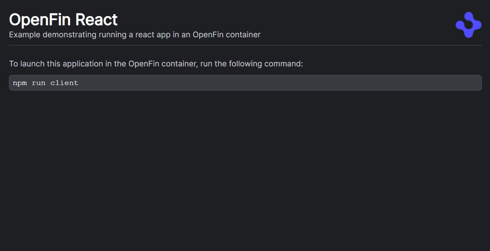
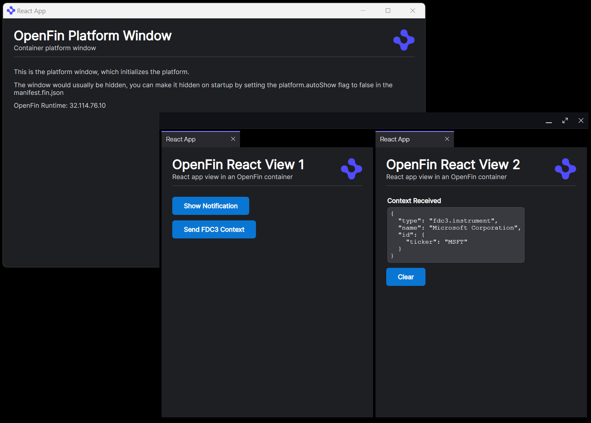
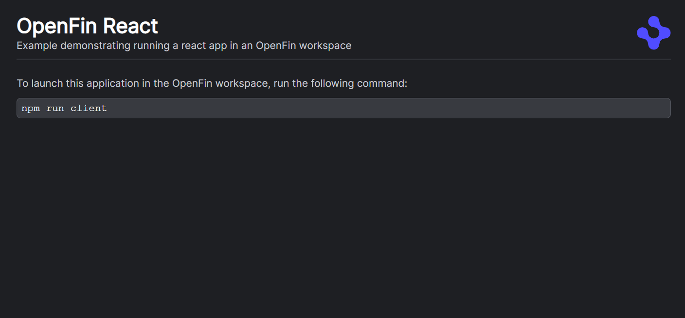
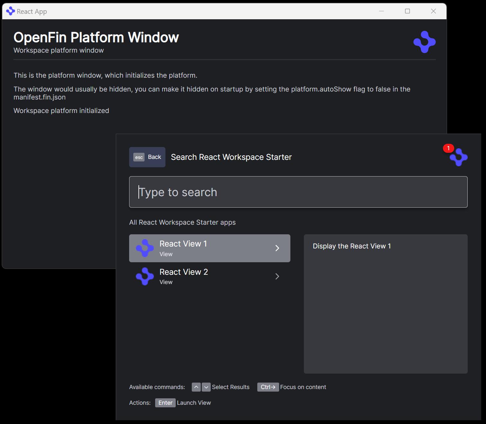
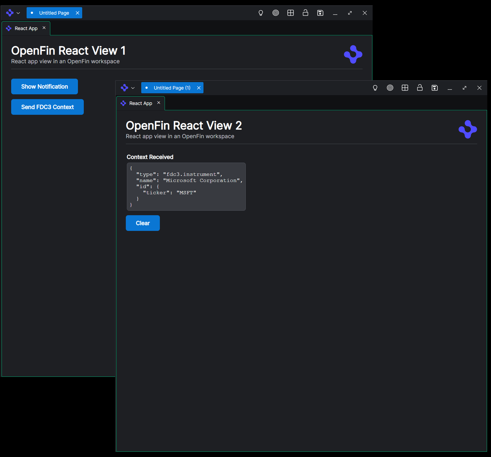
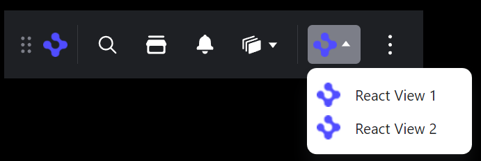
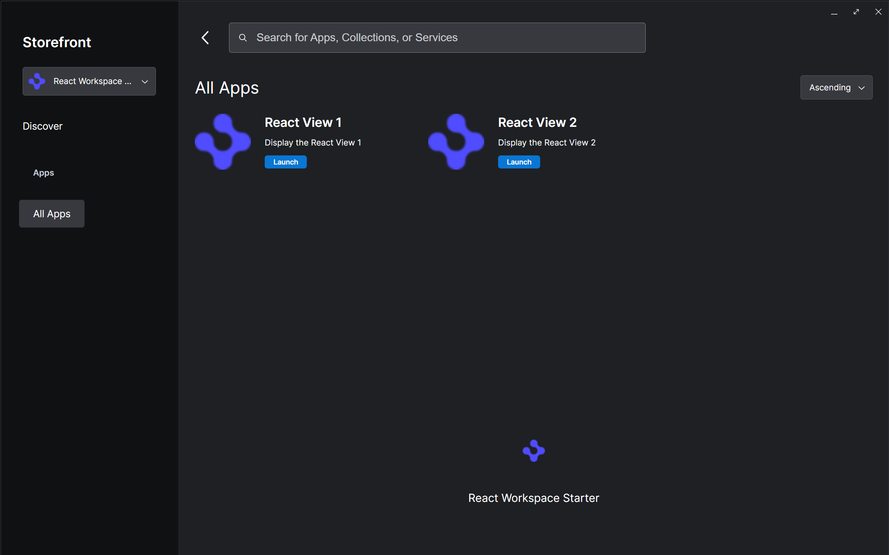
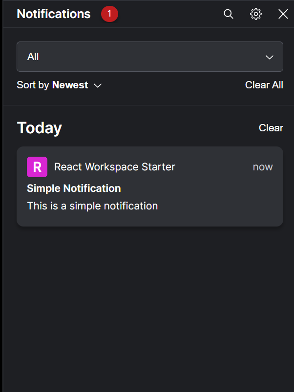

# React

Contained in this folder are samples for the following patterns.

* [container](./container) - A platform built using the HERE container technology.
* [workspace](./workspace) - A platform which demonstrates implementing a HERE Core platform and interacting with its components.

## Container

When you execute this example with `npm run start`, the following will launch your system browser (this is the [./container/src/App.tsx](./container/src/App.tsx) content).

If you then run `npm run client` it will start the platform instead, you should see the following.

The platform window content is the [./container/src/platform/Provider.tsx](./container/src/platform/Provider.tsx) which also initializes the platform.

The window with the two views are the [./container/src/views/View1.tsx](./container/src/views/View1.tsx) and [./container/src/views/View2.tsx](./container/src/views/View2.tsx) components.

These components demonstrate the following:

* Displaying a notification
* Broadcasting/listening for FDC3 contexts between views

## Workspace

When you execute this example with `npm run start`, the following will launch your system browser (this is the [./workspace/src/App.tsx](./workspace/src/App.tsx) content).

If you then run `npm run client` it will start the platform instead, you should see the following.

The platform window content is the [./workspace/src/platform/Provider.tsx](./workspace/src/platform/Provider.tsx) which also initializes the platform. The applications made available in your platform are read from [./workspace/public/platform/manifest.fin.json](./workspace/public/platform/manifest.fin.json)

The component visible with the platform window is the HERE Core Home component, the Home component lists 2 applications which can be launched.

These views demonstrate the following:

* Displaying a notification
* Broadcasting/listening for FDC3 contexts between views

Also from the Home component you can launch `/dock`

You can also launch `/store`

The notification center is launch with `/notifications`

